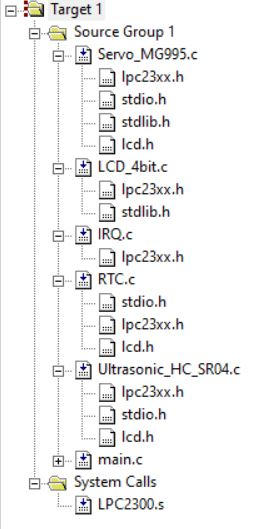

<h2>WOEMpet</h2>

This is an attempt at an automated pet feeding system using LPC2378. 
  It makes use of a servo motor which assists in dispensing food at the required interval and an ultrasonic sensor which helps with identifying the presence of a pet.

The user may pre-feed the specific times at which the food is to be dispensed along with certain buffer interval during which the presence of a pet would be monitored.

<h2>Hardware</h2>

 The following major components were used:

<ul>
  <li>NXP LPC2378</li>
  <li>Tower Pro MG995 servo motor</li>
  <li>HC-SR04 ultrasonic sensor</li>
</ul>
  
<h2>Software</h2>

The program directory is highlighted below: 

The main module is present in <i>main.c</i>. It controls the other modules spread across independent files with self explanatory names.
