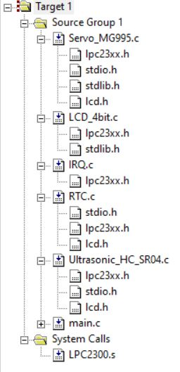

# WOEMpet
```README generated by Copilot[Claude Haiku 4.5]! (few manual edits though)``` 

An automated pet feeder with programmable feeding times using the LPC2378 microcontroller. It makes use of a servo motor which assists in dispensing food at the required interval and an ultrasonic sensor which helps with identifying the presence of a pet. The user may pre-feed the specific times at which the food is to be dispensed along with certain buffer interval during which the presence of a pet would be monitored. This project combines real-time scheduling, pet detection via ultrasonic sensing, and automated food dispensing with servo motor control.

## What It Does

- **Programmable Feeding Schedule**: Set specific feeding times at which food is to be dispensed
- **Pet Detection**: Ultrasonic HC-SR04 sensor monitors for pet presence within configurable buffer intervals
- **Automatic Dispensing**: PWM-controlled MG995 servo motor actuates the feeder mechanism
- **Real-Time Display**: 4-bit LCD displays current time, distance, and system status
- **Timing Validation**: Ensures pets are present before dispensing food

## Hardware

The following major components are used:

- **NXP LPC2378** - ARM Cortex-M3 32-bit microcontroller
  - 12 MHz XTAL with PLL → 48 MHz processor clock
  - 12 MHz peripheral clock
  - Flash-based program storage
  
- **Tower Pro MG995 Servo Motor** - PWM-controlled food dispenser
  - 50 Hz frequency (20ms period)
  - Duty cycle control: 5% (closed) to 10% (fully open)
  
- **HC-SR04 Ultrasonic Sensor** - Pet presence detection
  - GPIO-based trigger and echo measurement
  - Timer1 microsecond-precision measurements
  - Configurable detection range (1-30 cm)

- **4-bit LCD Display** - System feedback
  - Shows current time (HH:MM:SS)
  - Displays distance measurements
  - Status indicators


## Software Architecture

<p>The program directory is highlighted below: </p>

<p align = center>

</p>

The main module is present in <i>main.c</i>. It controls the other modules spread across independent files with self explanatory names.

### Core Modules

**main.c** - Main feeding control logic
- Implements the core feeding algorithm
- Coordinates sensor inputs and actuator outputs
- Manages feeding schedule and pet presence validation

**RTC.c** - Real-Time Clock (Timer0-based)
- 1ms interrupt tick generation
- Maintains hour, minute, second counters
- Displays formatted time on LCD

```c
// Timer0: 1ms interrupts at 12 MHz peripheral clock
T0MR0 = 11999;  // 1msec interval
T0MCR = 3;      // Interrupt and Reset on Match
```

**Servo_MG995.c** - PWM Servo Control
- 50 Hz PWM frequency (240kHz base timer)
- Duty cycle mapping:
  - 5% = 0° (closed/dispenser off)
  - 7.5% = 90° (opening position)
  - 10% = 180° (fully open)

```c
PWM1MR0 = 240000;                    // 20ms period (50 Hz)
PWM1MR1 = (dutyCycle * PWM1MR0) / 100; // Set pulse width
```

**Ultrasonic_HC_SR04.c** - Distance Sensor Driver
- Timer1-based microsecond precision timing
- 10µs trigger pulse on P0.2
- Echo measurement on P0.3
- Distance formula: `distance = (0.0343 * echoTime) / 2`

```c
sendPulse(n);                 // Generate trigger pulse
distance = calDistance(m);    // Measure echo time and calculate
```

**LCD_4bit.c** - 4-bit LCD Display Driver
- GPIO-based parallel interface
- Character display and cursor control
- Formatting utilities for time/distance output

**IRQ.c** - Interrupt Handler
- Timer0 interrupt service routine
- Manages 1ms clock tick generation

**LPC2300.s** - ARM Cortex-M3 Startup Code
- Vector table initialization
- Hardware setup sequence
- Entry point to main()


## Operating Parameters

| Parameter | Value | Notes |
|-----------|-------|-------|
| **Feeding Start Time** | Configurable (minutes) | Default begins at 00:00 |
| **Schedule Window** | 30 seconds | Buffer interval for pet presence detection |
| **Detection Range** | 1 - 30 cm | Valid distance for pet recognition |
| **Servo Active Duration** | ~2 seconds | Time dispenser remains open |
| **Feed Release Interval** | 1 minute | Minimum time between successive feedings |
| **LCD Update Rate** | 1 second | Display refresh interval |

## How It Works

The main feeding algorithm operates in a continuous loop with 1-second intervals:

```
Loop every second:
  1. Update RTC counter (increment seconds)
  2. Send ultrasonic trigger pulse to HC-SR04
  3. Calculate distance to pet (echo time measurement)
  4. Check if current time matches feeding schedule

  If feeding_time AND pet_present (distance < 30cm):
    - Capture current second as dispense timestamp
    - Set servo to 7.5% duty cycle (open position)
    - Mark food as dispensed
  
  If 2 seconds have elapsed since dispense:
    - Return servo to 5% duty cycle (closed)
    - Reset dispense flag
  
  Update LCD Display:
    - Current distance and release time counter
    - Current time in HH:MM:SS format
    - Clear and refresh for next cycle
```

## Building & Deployment

### Prerequisites
- Keil MDK (µVision 4+) or equivalent ARM compiler
- LPC2378 JTAG/Flash programmer
- Target board: MCB2300 Evaluation Board (or compatible)

